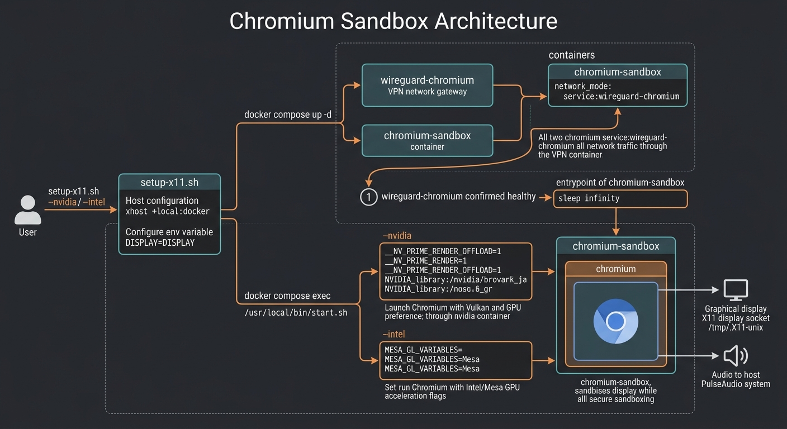

# Containerized Chromium Sandbox

A secure, GPU-accelerated Chromium container configuration that runs under a non-privileged user and routes all internet traffic through a WireGuard VPN gateway container. It supports local X11 display forwarding and PulseAudio sound routing.

## Architecture & Workflow

The architecture is designed to isolate Chromium for secure browsing:
1. **VPN Isolation**: The `chromium-sandbox` container shares the network namespace of the `wireguard-chromium` container. No traffic enters or exits the sandbox without passing through the VPN.
2. **Display & Sound Forwarding**: X11 socket (`/tmp/.X11-unix`) and PulseAudio socket (`/run/user/1000/pulse`) are mounted to forward GUI and audio to the host.
3. **GPU Acceleration**: Supports hardware acceleration for both Intel/Mesa (integrated) and NVIDIA GPUs.

Below is the workflow diagram:



## File Structure

- **[Dockerfile](Dockerfile)**: Sets up Debian Trixie, installs Chromium, fonts, rendering libraries, sets up user `chromium`, and points to `start.sh`.
- **[docker-compose.yml](docker-compose.yml)**: Defines `wireguard-chromium` and `chromium-sandbox` services with correct volume mounts, capabilities, and device mappings.
- **[setup-x11.sh](setup-x11.sh)**: Automates X11 display permissions, brings up Docker Compose containers, and runs Chromium with proper hardware-specific command line flags.
- **[start.sh](start.sh)**: A container-internal entrypoint script that sets default sandboxing and GPU flags for Chromium.

## Prerequisites

- **Docker & Docker Compose**
- **X11 Server** running on host
- **PulseAudio / PipeWire-Pulse** configured for network/unix connections
- For **NVIDIA**: NVIDIA Container Toolkit installed on the host.

## Usage

### Run with Intel / Integrated Graphics
To launch using Intel/Mesa graphics rendering:
```bash
./setup-x11.sh --intel
```

### Run with NVIDIA Graphics
To launch using NVIDIA discrete graphics via Prime Offload:
```bash
./setup-x11.sh --nvidia
```
